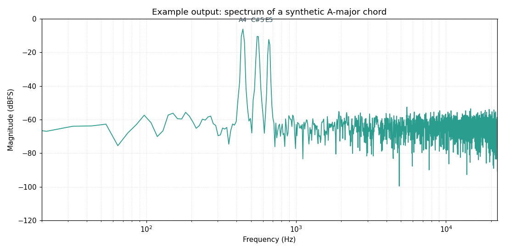

# Real-Time Audio Spectrum Analyzer

A live audio spectrum analyzer in Python. Speak, sing, whistle, or play music into
your microphone and watch its frequency content move in real time.

No special hardware is needed. Your laptop's built-in microphone is enough.



*Above: the spectrum of a synthetic A-major chord (A4, C#5, E5). Each note shows up
as a sharp peak at its frequency, sitting above a low noise floor. Your live mic
input will look just like this, but moving.*

---

## How it works?

Sound reaching your microphone is sampled 44,100 times per second into a long stream
of numbers. We slice off a small block (4,096 samples ≈ 93 ms), taper its edges with
a Hann **window** so the block's start and end blend smoothly, then run it through the
**FFT**. The FFT answers one question: *"what mix of pure sine waves, at which
frequencies, would add up to this block?"* We take the **magnitude** of that answer
(how strong each frequency is), convert it to **decibels** so quiet detail is visible,
and draw it. Doing this ~30 times a second produces a live, moving spectrum.

---

## Project structure

| File | What it does |
| --- | --- |
| `dsp_core.py` | The pure signal-processing math (window → FFT → magnitude → dB). No audio or plotting code. This is the part worth truly understanding. |
| `spectrum_analyzer.py` | The main program: opens the mic and animates the live spectrum. |
| `analyze_file.py` | Bonus: analyze an audio **file** instead of the mic, using Librosa. Shows waveform, spectrum, and spectrogram. |
| `test_dsp.py` | A self-test that feeds known sine waves through the core and checks the answers. Proves the math is right without a microphone. |
| `requirements.txt` | The Python packages you need. |

The design deliberately separates the *math* (`dsp_core.py`) from the *input/output*
(microphone, plotting, file loading). The real-time analyzer is essentially the core
functions called repeatedly on fresh audio.

---

## Requirements

- **Python 3.9 or newer.**
- A working **microphone** (built-in is fine) for the live analyzer.
- An internet connection only to install the packages the first time.

The live analyzer uses [`sounddevice`](https://python-sounddevice.readthedocs.io/),
which relies on a small system audio library called **PortAudio**. On most systems
`pip` handles it automatically, but see the notes below if installation complains.

---

## Installation

Clone the repo and (recommended) create a virtual environment so this project's
packages stay isolated from the rest of your system:

```bash
git clone https://github.com/<your-username>/spectrum-analyzer.git
cd spectrum-analyzer

# Create and activate a virtual environment
python -m venv .venv
# macOS / Linux:
source .venv/bin/activate
# Windows (PowerShell):
# .venv\Scripts\Activate.ps1

# Install the dependencies
pip install -r requirements.txt
```

### Platform notes

- **Windows** — `pip install sounddevice` usually bundles PortAudio. Nothing extra
  needed. The first time you run, Windows may ask for microphone permission.
- **macOS** — if `sounddevice` fails to import, install PortAudio with Homebrew:
  `brew install portaudio`, then reinstall: `pip install --force-reinstall sounddevice`.
  macOS will prompt for microphone access on first run; you must allow it (also check
  System Settings → Privacy & Security → Microphone).
- **Linux** — install PortAudio from your package manager first, e.g. on
  Debian/Ubuntu: `sudo apt install libportaudio2`. For `analyze_file.py` to read MP3s
  you may also want `ffmpeg`: `sudo apt install ffmpeg`.

> `librosa` is only needed for the optional `analyze_file.py`. If you only want the
> live analyzer, you can skip it.

---

## Running it

**1. Verify the math first (no microphone needed):**

```bash
python test_dsp.py
```

You should see all tests pass, including a 1000 Hz sine being detected at exactly
1000 Hz with its amplitude recovered. If this passes, the core is sound.

**2. Run the live spectrum analyzer:**

```bash
python spectrum_analyzer.py
```

A window opens with a flat line. Make some noise. Try:

- **Whistling a rising note** — watch a single peak slide to the right.
- **Saying "ssssss"** — see broad energy spread across high frequencies.
- **Humming a low "mmm"** — see a sharp peak on the left, with smaller *harmonics*
  (evenly spaced peaks at multiples of the fundamental) trailing to the right.
- **Playing a song** — watch bass on the left, cymbals and hiss on the right.

Close the window to stop.

**3. (Optional) Analyze an audio file:**

```bash
python analyze_file.py path/to/some_audio.wav
```

This shows the waveform, a single-frame spectrum, and a full spectrogram (frequency
content over time). Useful if microphone permissions are giving you trouble.

---

## Reading the display

- **X axis (frequency, Hz, log scale).** Left is low/bass, right is high/treble. The
  axis is logarithmic because each octave (a doubling of frequency) is perceptually
  equal, so a log axis spreads musical pitch evenly. It runs from 20 Hz (the low edge
  of human hearing) up to 22,050 Hz (the *Nyquist* limit = half the sample rate).
- **Y axis (magnitude, dBFS).** How strong each frequency is, in decibels relative to
  full scale. 0 dB is the loudest a normalized sample can be; quieter is more
  negative. Decibels are used because hearing is roughly logarithmic and mic signals
  span a huge range — on a plain linear axis, quiet detail would vanish into a flat
  line near zero.
- **Peaks** are the frequencies present right now. A pure tone is one sharp peak.
  A real voice or instrument has a low **fundamental** plus a series of **harmonics**.

---

## The key ideas, explained gently

**Sampling.** A microphone measures air pressure thousands of times per second. At
44,100 samples/sec, the highest frequency you can faithfully capture is half of that,
22,050 Hz — the **Nyquist frequency**. Anything above it can't be represented and, if
present, gets falsely folded down to a lower frequency (*aliasing*).

**Why we slice into blocks.** The FFT works on a fixed-size chunk. We use 4,096
samples (~93 ms) per chunk. Bigger chunks give finer frequency detail but update less
often; smaller chunks update faster but blur nearby frequencies together. The trade-off
is *frequency resolution = sample_rate / block_size* ≈ 10.8 Hz per bin here.

**Windowing (the non-obvious one).** The FFT secretly assumes your chunk repeats
forever, end to end. A raw chunk rarely starts and ends at the same value, so that
imagined loop has a sudden jump at the seam. The FFT reads that jump as fake
high-frequency energy and smears every real tone across neighboring bins — *spectral
leakage*. A **Hann window** multiplies the chunk by a smooth bell shape that fades to
zero at both edges, removing the seam and dramatically cleaning up the spectrum.
Try commenting the window out to *see* leakage for yourself.

**The FFT and magnitude.** The FFT decomposes the windowed block into a set of sine
waves and reports each one as a complex number encoding both *amplitude* and *phase*.
We take the **magnitude** (`abs`) because we only care how much of each frequency is
present, not its phase. We use the *real* FFT (`rfft`) because audio is real-valued, so
only the positive-frequency half is needed — half the work.

**Normalization and dB.** Raw FFT output has arbitrary scale. `dsp_core.py` normalizes
by the window so a pure sine of amplitude *A* reads back as a peak of height *A* — that
is exactly what `test_dsp.py` checks. Then `20 * log10(...)` converts to decibels.

---

## Configuration

Open `spectrum_analyzer.py` and edit the constants near the top:

- `SAMPLE_RATE` (default `44100`) — samples per second. Sets the Nyquist ceiling.
- `BLOCK_SIZE` (default `4096`) — samples per FFT frame. Larger = finer frequency
  detail but slower, chunkier updates. Try `8192` or `1024` and feel the difference.
- `CHANNELS` (default `1`) — mono input.

---

## Troubleshooting

- **The line stays flat / nothing moves.** Your OS likely hasn't granted microphone
  access, or the wrong input device is selected. Check your system's microphone
  privacy settings, and make sure the mic isn't muted. You can list/choose devices
  with `python -c "import sounddevice as sd; print(sd.query_devices())"`.
- **`OSError: PortAudio library not found` or `sounddevice` import errors.** Install
  PortAudio for your platform (see *Platform notes* above), then reinstall
  `sounddevice`.
- **`ModuleNotFoundError`.** Activate your virtual environment and run
  `pip install -r requirements.txt` again.
- **Input overflow messages.** Harmless under load; the machine briefly couldn't keep
  up. Increasing `BLOCK_SIZE` reduces how often this happens.
- **`analyze_file.py` can't read an MP3.** Install `ffmpeg` (see Linux note) — Librosa
  uses it for compressed formats. WAV files always work.
- **The plot window won't open on a remote/headless machine.** Real-time plotting needs
  a display. Use `analyze_file.py` and save the figure, or run locally.

---

## Experiments to try

Once it runs, learning happens fastest by breaking things on purpose:

1. **Remove the window.** In `dsp_core.py`, skip multiplying by the window. Whistle a
   steady note and watch the peak get fatter and messier — that's spectral leakage.
2. **Shrink the block size** to `1024`. Updates get snappy but frequency detail blurs.
3. **Switch the X axis to linear** (`ax.plot` instead of `ax.semilogx`). Notice how bass
   gets squished into the far left, which is why log is the better default.
4. **Add a peak-frequency readout** — use `numpy.argmax` on the magnitude to print the
   dominant frequency, turning this into a rough pitch detector.
5. **Color the line by loudness**, or fill under the curve, to make it prettier.

---

## Where to go next

This project gives you the frequency domain. Natural follow-ups, each building on it:

1. **FIR / IIR filter design** — learn to *reshape* the spectrum you can now see
   (low-pass, high-pass, band-pass). Pure software, no mic required.
2. **DTMF tone decoder** — apply the FFT (or the Goertzel algorithm) to decode the
   dual tones of a telephone keypad.
3. **Real-time audio effects** — echo, reverb, pitch shift with circular buffers, your
   first taste of streaming signal processing.

---

## License

Released under the MIT License. Use it, learn from it, build on it freely.
